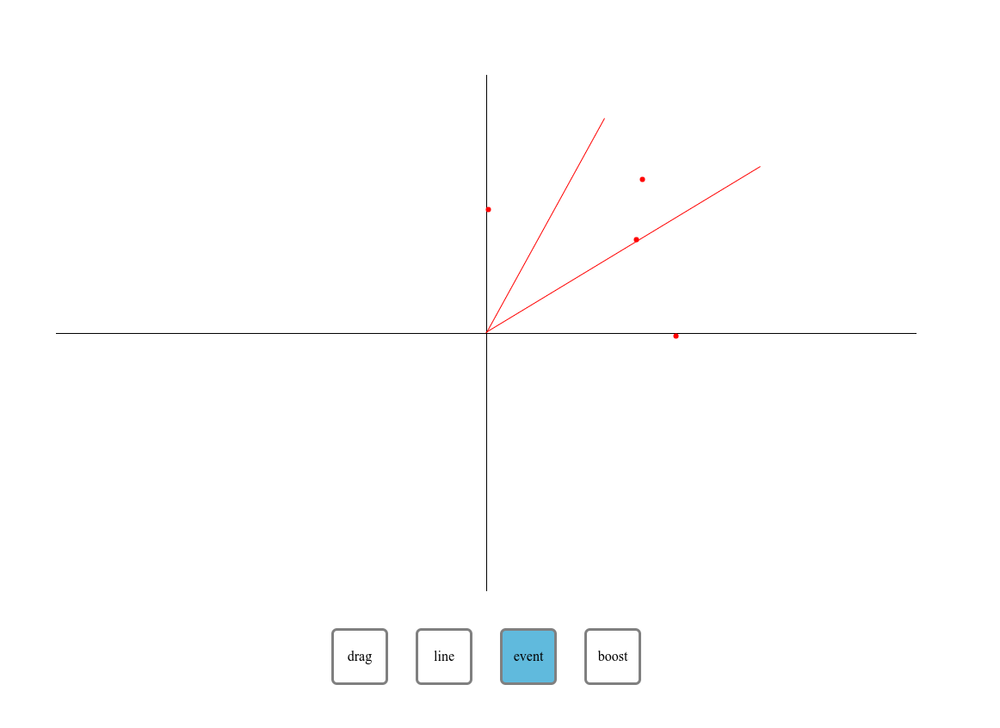

# Lorentz

An interactive website for visualizing Lorentz transformations.

# Features

- Draw worldlines and events
- Boost to a specific velocity

# Todo

- Boost to a selected worldline
- Specify numeric coordinates of events and worldlines
- Create axis for a moving reference frame

Feel free to open an issue for any additional features!
